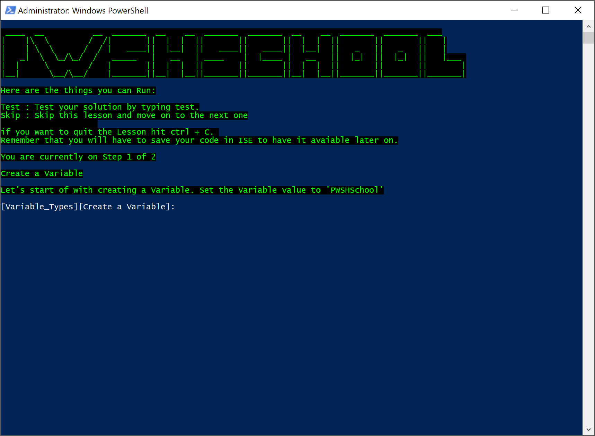
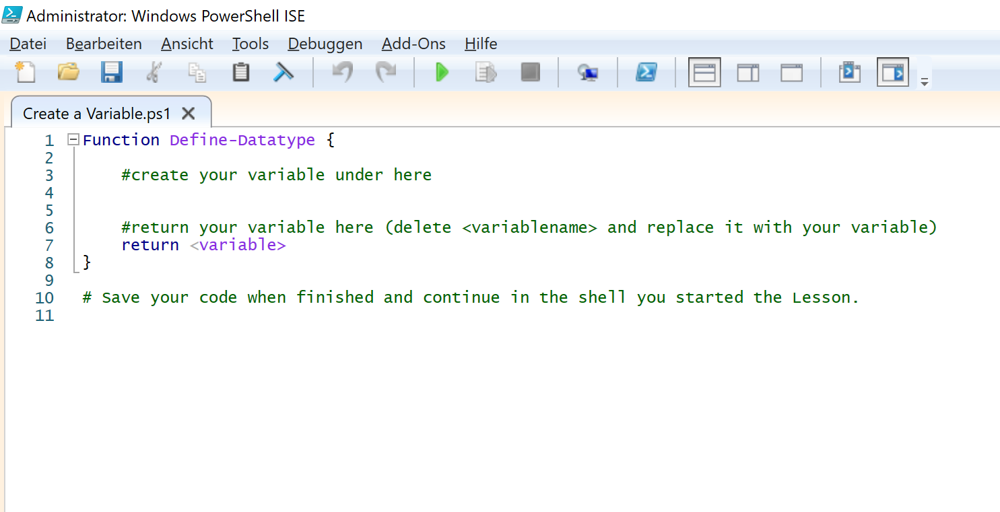
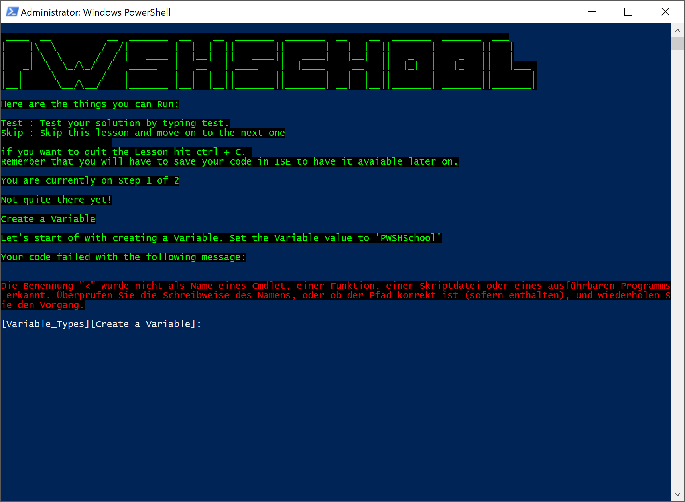

# Take Lessons

Hey, in this document you will learn how to use PWSHSchool as a Student. 

First of all let's look at what steps are needed for you to be able to use PWSHSchool.

## Prerequisites

### Install the Module (Not yet available on the Gallery. Gonna upload it soon)

```
Find-Module -Name PWSHSchool | Install-Module
Find-Module -Name Pester | Install-Module
Import-Module PWSHSchool
```

Note that you do need the Pester Module (Powershell testing framework) in order to use this Module
There is however no need for you to import it every time. PWSHSchool does that for you.

## Find the lessons suited best for you

Once you completed the prerequisites you'll have installed the module and importet it.

It is now ready to use! So let's take advantage of that.

### Find Lessons

to search for lessons you can use the following code.

```
Get-PWSHSchoolLesson
```

This will list you all the Lessons that are available in your version. It will look something like this:
```
Name              Level Step
----              ----- ----
Variable_Types Beginner {Step, Step}
```

If you know a lesson by name you can add the name parameter to your function:

```
Get-PWSHSchoolLesson -Name "Variable_Types"
```

In this case it will return the same output (since there is one lesson available so far:) this will get updated as soon as more lessons are available) The output will look like this:
```
Name              Level Step
----              ----- ----
Variable_Types Beginner {Step, Step}
```

## Start a lesson

Once you found a lesson you can start a lesson with the following code:
```
Start-PWSHSchoolLesson -Lesson Variable_Datatypes
```
### Autocompletion
All lessons available support autocompletion. You can therefore also use that to browse for keywords.

## How lessons work

### Console --> Interface
Ok you started your Lesson. Now the console you started in will become your Interface. This will look like this:



Note that in the console you will at all time see on which step you are, what your current task is and you also
get displayed what you can enter in the console. 

### ISE --> Editor
Next to the console getting your interface, Powershell ISE will start up and load your first task. 

As an example. The first task from the Variable_Types Lesson will look like this in the ISE



## Edit and test your code

So the Workflow is the Following:

* Read the Task in the Console
* Edit your code according to the Task in the console
* Save your code in the ISE
* now you can run a test

## Test your code

To run a test, simply type "test" in the console and hit enter.

If your test fails you will get shown the error message in the console:



If your code passes the tests you will automatically move on to the next task.

## Skip a task

You can also skip a task if you are not interessted or can't handle it at that time (or god forbid even a bug appears)
Your progress will be saved (by you in the ISE) and the next time you get to that task you will be asked if you want to continue.

To skip the task, simply type "skip" in the console and hit enter.

## Exit 

If you want to exit, simply hit ctrl+c and you'll be in your shell just as before you started.

As long as you save your code in the ISE, you will be able to pick up right where you left.

## Clear the lesson

You feel like you need a new start to a specific lesson? Exit the lesson and use the following 
code to clear it up and you'll be able to have a new start:

```
Clear-PWSHSchoolLesson -Lesson Variable_Datatypes
```

## That's it

That it folks! You can now use PWSHSchool! Have fun learning!
